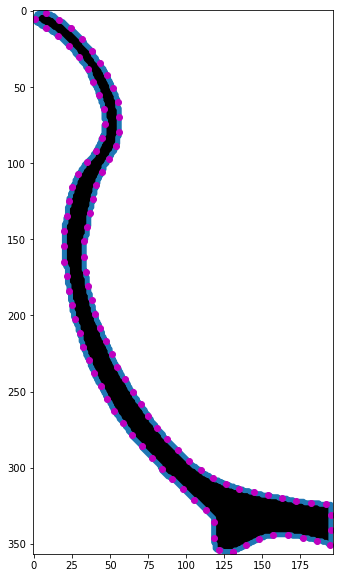
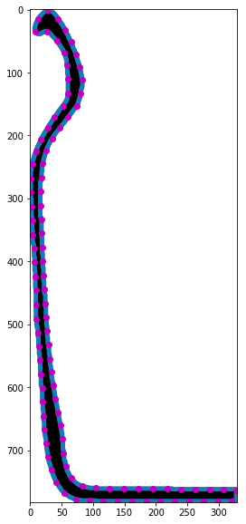
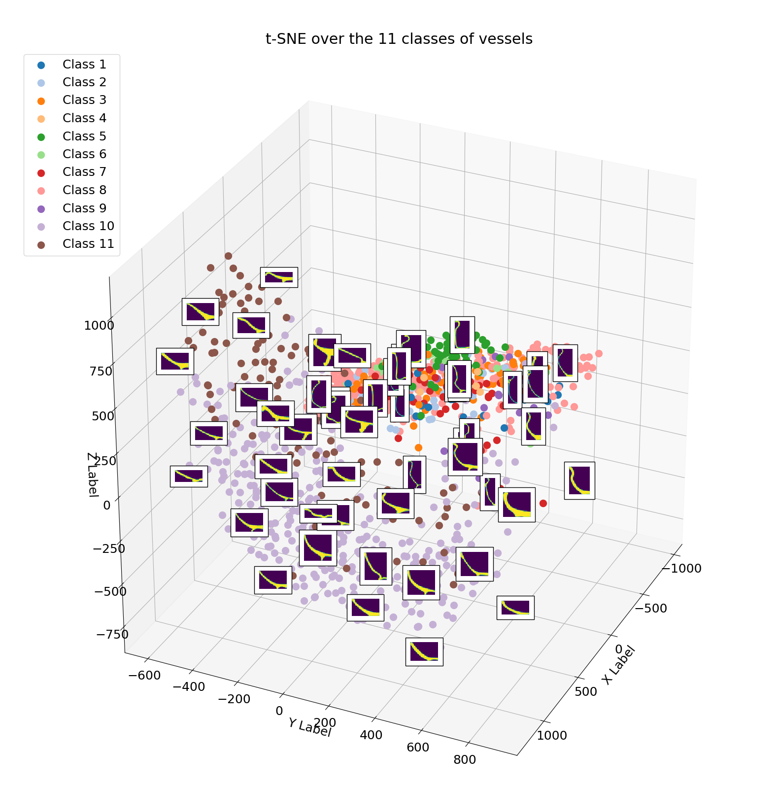

# 2D and 3D pottery geometric analysis and generation
In this repo you can find:

- Preprocessing pipeline with skimage to extract contourns and semilandmarks. solid revolution based on semilandmarks.
- Dimension reduction over semilandmarks and over raw pixel space and clustering.
- CNN classification over the 11 pottery classes.
- 2D GAN trained network over pixel space to generate new pottery contourns.
- 3D GAN trained network over voxel space to generate new 3D pottery.

## 2D GAN generation on 100 epochs

## 3D GAN based on stl models of solid revolution of 100 semilandmarks

### Semilandmarks examples

### TSNE over raw pixel space

