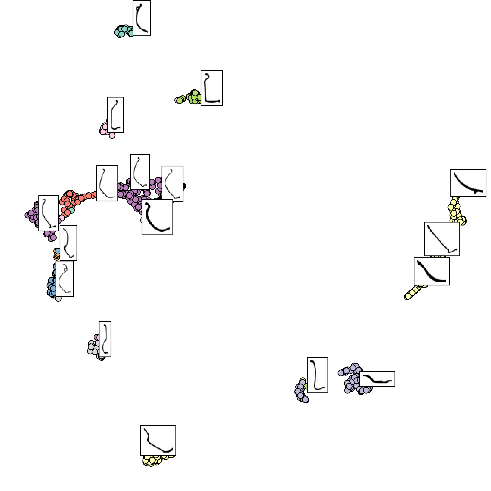
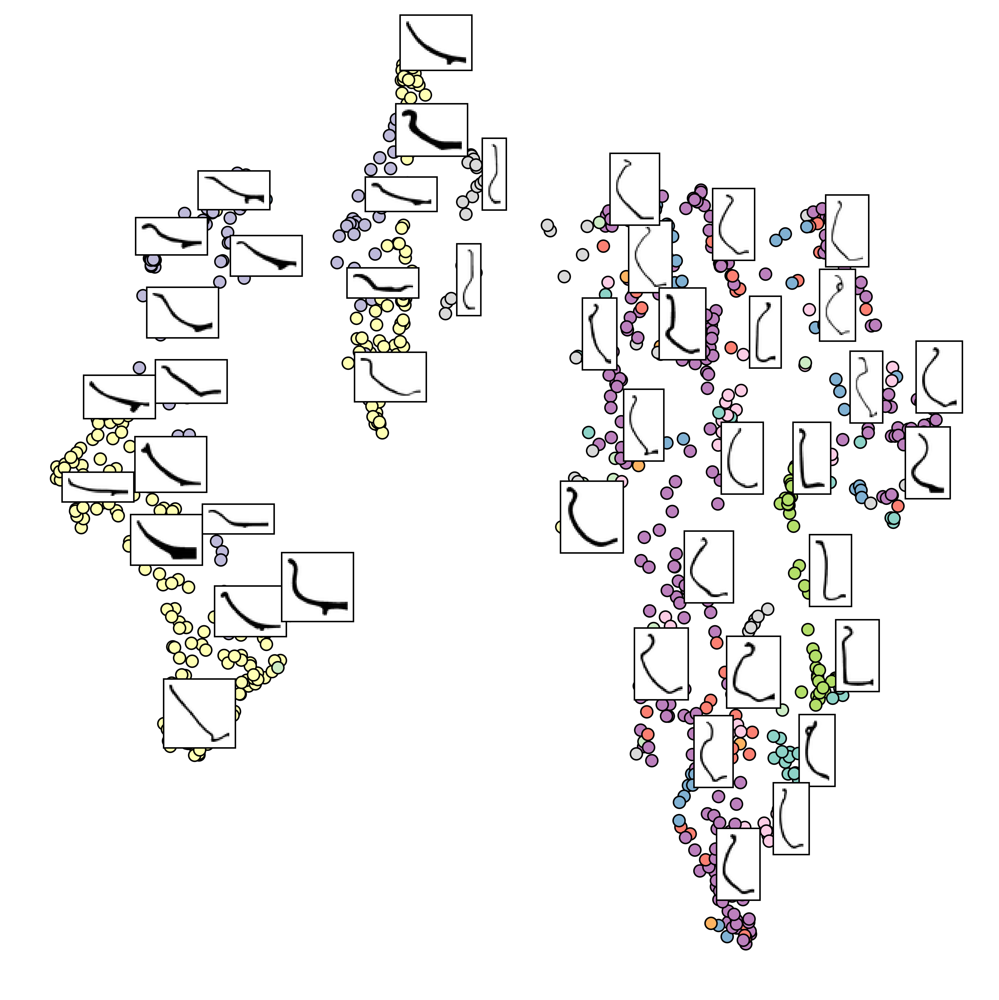
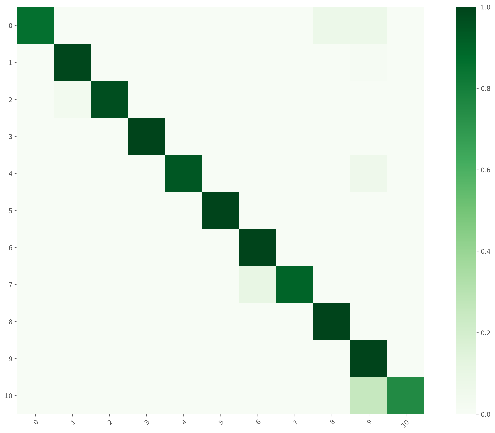

# Learning feature representation of Iberian ceramics with automatic classification models

[](https://doi.org/10.1016/j.culher.2021.01.003)

## Abstract

In Cultural Heritage inquiries, a common requirement is to establish time-based trends between archaeological artifacts belonging to different periods of a given culture, enabling among other things to determine chronological inferences with higher accuracy and precision.
Among these, pottery vessels are significantly useful, given their relative abundance in most archaeological sites.
However, this very abundance makes difficult and complex an accurate representation, since no two of these vessels are identical, and therefore classification criteria must be justified and applied.
For this purpose, we propose the use of deep learning architectures to extract automatically learned features without prior knowledge or engineered features.
By means of transfer learning, we retrained a Residual Neural Network with a binary image database of Iberian wheel-made pottery vessels' profiles. 
These vessels pertain to archaeological sites located in the upper valley of the Guadalquivir River (Spain).
The resulting model can provide an accurate feature representation space, which can automatically classify profile images, achieving a mean accuracy of $0.96$ with an $f$-measure of $0.96$. 
This accuracy is remarkably higher than other state-of-the-art machine learning approaches, where several feature extraction techniques were applied together with multiple classifier models.
These results provide novel strategies to current research in automatic feature representation and classification of different objects of study within the Archaeology domain. 

## Dataset

The profile images correspond to domain experts' drawings from Iberian wheel-made vessels collected in various archaeological sites located along the upper valley of the Guadalquivir River (Spain). The classification of the vessels corresponds to eleven different classes based on the shape. These include the forms of the lip, neck, body, base, and handles, and the relative ratios between their sizes.
Nine of these classes correspond to closed vessel shapes, while the two other belong to open ones.

## UMAP visualization for the Pretraind ResNet with feature extraction


## UMAP visualization for the CNN with feature extraction


## Normalized confusion Matrix of the predicted results of the SVC


## Citation

```Latex
@article{NAVARRO202165,
title = {Learning feature representation of Iberian ceramics with automatic classification models},
journal = {Journal of Cultural Heritage},
volume = {48},
pages = {65-73},
year = {2021},
issn = {1296-2074},
doi = {https://doi.org/10.1016/j.culher.2021.01.003},
url = {https://www.sciencedirect.com/science/article/pii/S1296207421000042},
author = {Pablo Navarro and Celia Cintas and Manuel Lucena and José Manuel Fuertes and Claudio Delrieux and Manuel Molinos},
keywords = {Representation learning, Iberian pottery, Deep learning},
}
```

## More Papers

- Automatic feature extraction and classification of Iberian ceramics based on deep convolutional networks

[](https://doi.org/10.1016/j.culher.2019.06.005)
[](https://github.com/celiacintas/vasijas)

- Reconstruction of Iberian ceramic potteries using auto-encoder generative adversarial networks

[](https://github.com/celiacintas/vasijas/tree/iberianGAN)
