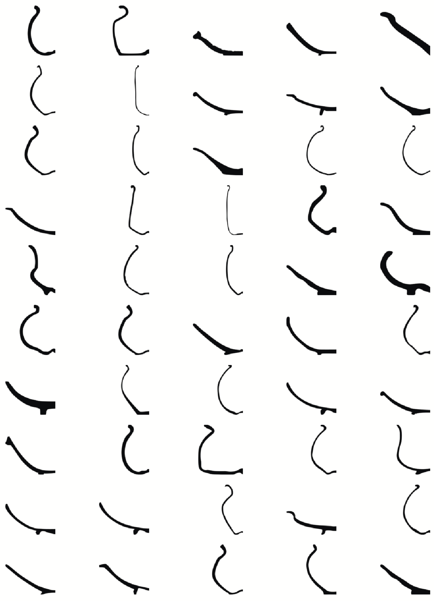
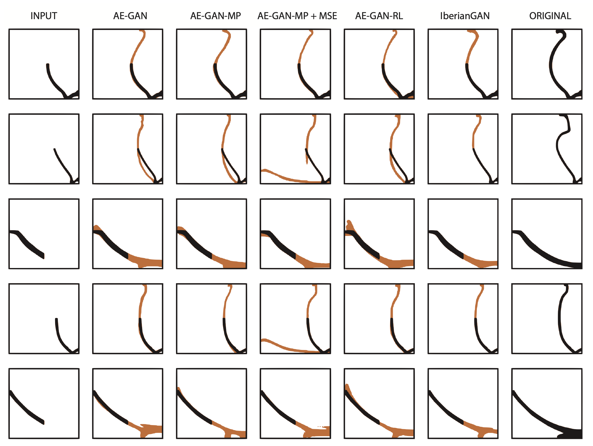

# IberianVoxel: Automatic Completion of Iberian Ceramics for Cultural Heritage Studies

## Abstract
Accurate completion of archaeological artifacts is a critical aspect in several archaeological studies, including documentation of variations in style, inference of chronological and ethnic groups, and trading routes trends, among many others.
However, most available pottery is fragmented, leading to missing textural and morphological cues.
Currently, the reassembly and completion of fragmented ceramics is a daunting and time-consuming task, done almost exclusively by hand, which requires the physical manipulation of the fragments.
To overcome the challenges of manual reconstruction, reduce the materials' exposure and deterioration, and improve the quality of reconstructed samples, we present IberianVoxel, a novel 3D Autoencoder Generative Adversarial Network (3D AE-GAN) framework tested on an extensive database with complete and fragmented references.
We generated a collection of $1001$ 3D voxelized samples and their fragmented references from Iberian wheel-made pottery profiles.
The fragments generated are stratified into different size groups and across multiple pottery classes.
Lastly, we provide quantitative and qualitative assessments to measure the quality of the reconstructed voxelized samples by our proposed method and archaeologists' evaluation.

## Dataset

The raw data belong to binary profile images, corresponding to Iberian wheel-made pottery from various archaeological sites of the upper valley of the Guadalquivir River (Spain). The available images consist of a profile view of the pottery, where image resolutions (in pixels), corresponding to size scale, may vary according to the acquisition settings. We partitioned these images into rim and base portion to simulate the fractures in the profiles. The partitioning criterion and orientation depends on the initial shape (closed or open).


[](https://drive.google.com/file/d/11BfsJQocyZyHcx53IbsZAJFcHasW5yNR/view?usp=sharing)




## Overview


## Results


## More Papers

- Reconstruction of Iberian ceramic potteries using auto-encoder generative adversarial networks
  
[](https://doi.org/10.1038/s41598-022-14910-7)
[]((https://github.com/celiacintas/vasijas/tree/iberianGAN)

- Learning feature representation of Iberian ceramics with automatic classification models

[](https://doi.org/10.1016/j.culher.2021.01.003)
[](https://github.com/celiacintas/vasijas/tree/unsupervised)

- Automatic feature extraction and classification of Iberian ceramics based on deep convolutional networks

[](https://doi.org/10.1016/j.culher.2019.06.005)
[](https://github.com/celiacintas/vasijas/tree/classification)

### Citation

```
Soon IJCAI 2023

```


