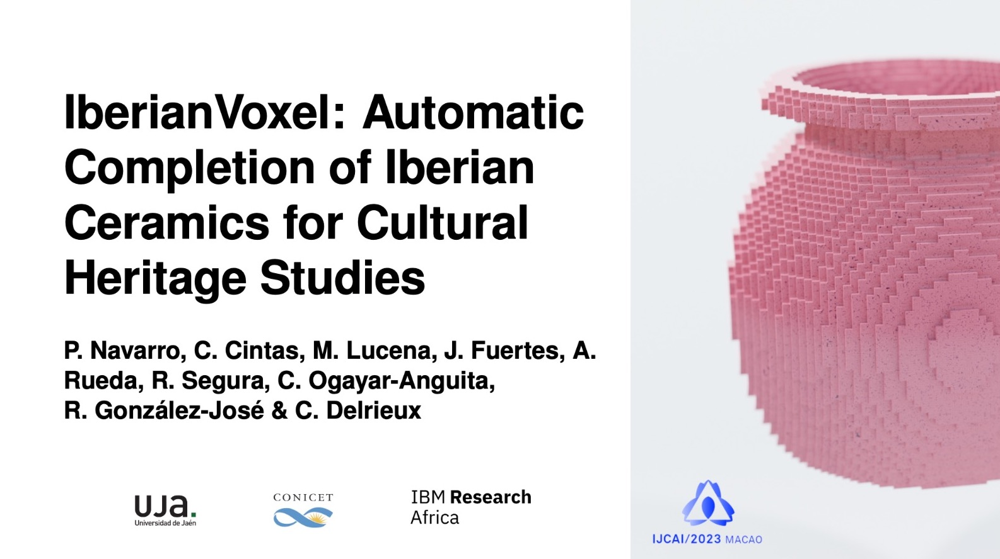

## Abstract

Accurate completion of archaeological artifacts is a critical aspect in several archaeological studies, including documentation of variations in style, inference of chronological and ethnic groups, and trading routes trends, among many others.
However, most available pottery is fragmented, leading to missing textural and morphological cues.
Currently, the reassembly and completion of fragmented ceramics is a daunting and time-consuming task, done almost exclusively by hand, which requires the physical manipulation of the fragments.
To overcome the challenges of manual reconstruction, reduce the materials' exposure and deterioration, and improve the quality of reconstructed samples, we present IberianVoxel, a novel 3D Autoencoder Generative Adversarial Network (3D AE-GAN) framework tested on an extensive database with complete and fragmented references.
We generated a collection of $1001$ 3D voxelized samples and their fragmented references from Iberian wheel-made pottery profiles.
The fragments generated are stratified into different size groups and across multiple pottery classes.
Lastly, we provide quantitative and qualitative assessments to measure the quality of the reconstructed voxelized samples by our proposed method and archaeologists' evaluation.

[](https://doi.org/10.24963/ijcai.2023/647)
[](https://huggingface.co/spaces/pablo1n7/iberianVoxels)

## Dataset

[Download the dataset](https://drive.google.com/file/d/1EPdY6lI2DYYYVtqGVT6-GFNCxTnxBlXV/view?usp=sharing) and put in `vasijas/data`.

The ceramics are classified into eleven different classes based on their shape. These classes consider the forms of the lip, neck, body, base, and handles and the relative ratios between their sizes. Nine of these classes correspond to closed pottery shapes, and two others belong to open ones. 

The directory tree is:
      
```
vasijas
└── data
    ├── Test
          └── 1
          └── 2
          └── 3
          ...
          └── 11
    ├── Train
          └── 1
          └── 2
          └── 3
          ...
          └── 11
    
```

Each file is made up of the pottery ID and the number of fragments.


data/(test or train)/CLASS/**POTTERY_ID**-n**NroFragments**-*.vox
      
example: **data/test/9/AL_11D-n005-t1649436904.vox**


[Dataset View (Notebook)](https://github.com/celiacintas/vasijas/blob/iberianVox/dataset_view.ipynb)

[](https://colab.research.google.com/drive/1XvBdlCnpgWHetkh4_kZ-AzDnYv5q6SrK?usp=sharing)


## Weights of IberianVoxel

Download the weights [here](https://drive.google.com/file/d/1dMDTLZa3S_TxrhCaBSbp8T48ylR2jvpD/view?usp=sharing)

## Dependencies 

Run it locally using python 3.11 and installing the dependencies:

### Alternative Pip:

```bash

pip install - r requirements.txt

```

### Alternative Conda:

```bash

conda env create -f environment.yml

# Activate the new environment:
conda activate vasija

```

In this repo, we use [pyvox](https://github.com/gromgull/py-vox-io) to open and write the vox files.

## Examples [](https://colab.research.google.com/drive/1hNTGacyl28ysMhFMm3a3XUOmSUeVju47?usp=sharing)

[Test generate (Notebook)](https://github.com/celiacintas/vasijas/blob/iberianVox/example.ipynb)


## Train

In a terminal, execute the training script:

```bash

python train_net.py --nepoch 100 --device cpu

```

*   **nepoch:** Number of epochs.
*   **bsize:** Batch size
*   **lrG:** Learning rate G.
*   **lrD:** Learning rate D.
*   **available_device:** Type of device for train. (cpu, cuda).


## More Papers

- Reconstruction of Iberian ceramic potteries using auto-encoder generative adversarial networks

[](https://doi.org/10.1038/s41598-022-14910-7)
[](https://github.com/celiacintas/vasijas/tree/iberianGAN)

- Learning feature representation of Iberian ceramics with automatic classification models

[](https://doi.org/10.1016/j.culher.2021.01.003)
[](https://github.com/celiacintas/vasijas/tree/unsupervised)

- Automatic feature extraction and classification of Iberian ceramics based on deep convolutional networks

[](https://doi.org/10.1016/j.culher.2019.06.005)
[](https://github.com/celiacintas/vasijas/tree/classification)

### Citation

```
@inproceedings{ijcai2023p647,
  title     = {IberianVoxel: Automatic Completion of Iberian Ceramics for Cultural Heritage Studies},
  author    = {Navarro, Pablo and Cintas, Celia and Lucena, Manuel and Fuertes, José Manuel and Rueda, Antonio and Segura, Rafael and Ogayar-Anguita, Carlos and González-José, Rolando and Delrieux, Claudio},
  booktitle = {Proceedings of the Thirty-Second International Joint Conference on
               Artificial Intelligence, {IJCAI-23}},
  publisher = {International Joint Conferences on Artificial Intelligence Organization},
  editor    = {Edith Elkind},
  pages     = {5833--5841},
  year      = {2023},
  month     = {8},
  note      = {AI and Arts},
  doi       = {10.24963/ijcai.2023/647},
  url       = {https://doi.org/10.24963/ijcai.2023/647},
}
```
