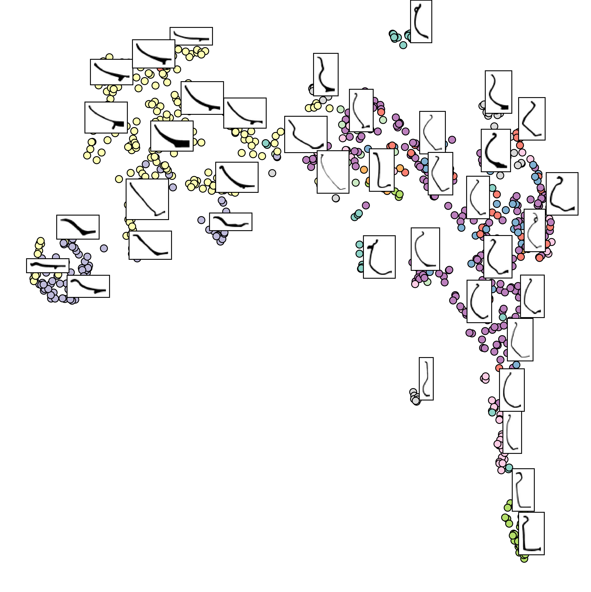

#

Pottery classes

In this repo you can find:

- ResNet pretrain for classification over the 11 pottery classes.
- CNN classification over the 11 pottery classes.
- Train SVC and RFC.

## UMAP visualization for the Pretraind ResNet with feature extraction

## UMAP visualization for the CNN with feature extraction

## Normalized confusion Matrix of the predicted results of the SVC

